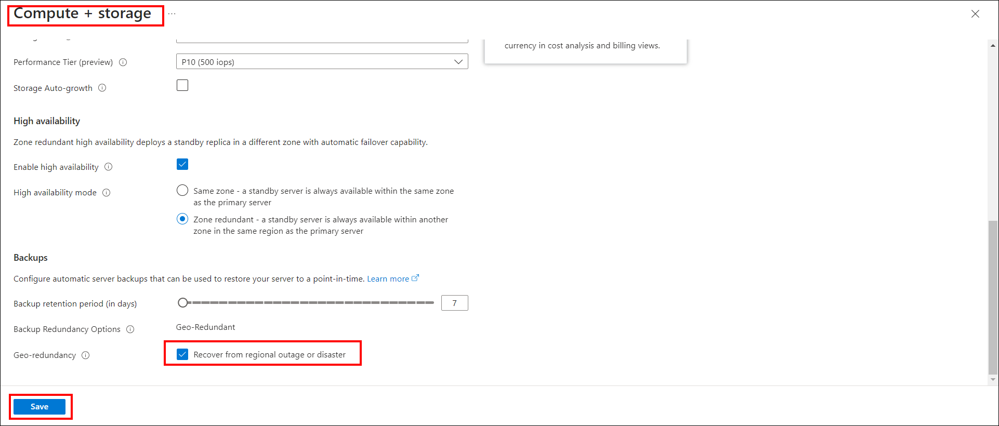
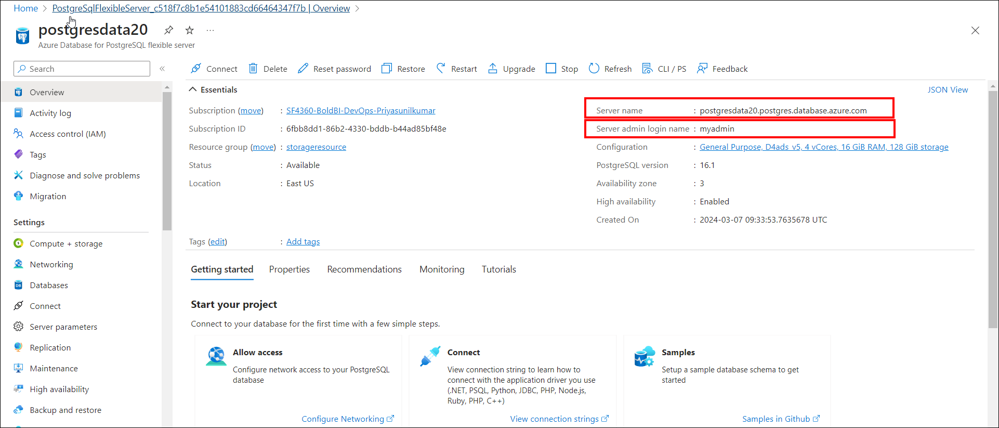
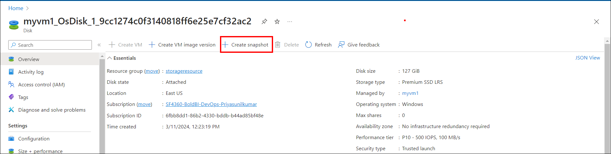
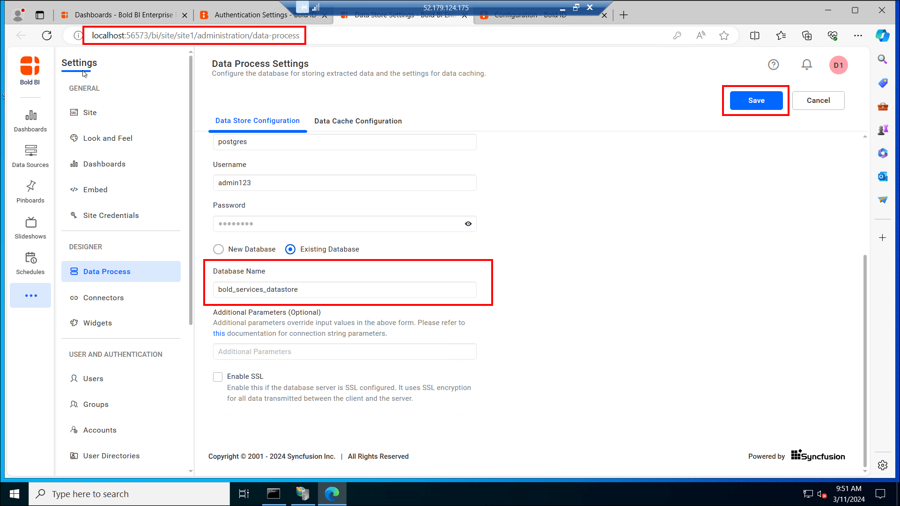

# Steps to Install and Enable Backup Compatibility of Bold BI on Azure Windows

| SEO Details       |                                                                     |
|-------------------|---------------------------------------------------------------------|
| Meta Title        | Installing and Enabling Backup Compatibility for Bold BI on Azure Windows |
| Meta Description  | Learn how to install Bold BI on Azure Windows and enable backup compatibility with easy-to-follow steps. Ensure data protection and disaster recovery for your Bold BI installation. |

## Below are the steps that will help you to install Bold BI.

### 1. Create a Windows Virtual Machine (VM)

To Create a Windows virtual machine on Azure, Please refer to the link: [Quick Create Portal](https://learn.microsoft.com/en-us/azure/virtual-machines/windows/quick-create-portal).

### 2. Connect to the Windows VM from your Machine

Establish a connection to the Windows VM from your local Machine:
- Launch the Remote Desktop application on your Machine,a dialog box will appear.
- In the Remote Desktop Connection dialog box, input the IP address or hostname of the Windows VM. In the "Show More" option, select the username by entering AzureAD\VMusername.
- Click "Connect."
- When prompted, enter your credentials (username and password) for the Windows VM.
- Once connected, you'll see the Windows VM desktop on your Machine.

### 3. Setting up PostgreSQL Database
 If you want to set up a PostgreSQL database on a Windows VM, follow the first step. If you prefer using a managed database in Azure, follow the second step.
  #### a. Setting up PostgreSQL in Windows VM
  To set up a PostgreSQL database in Windows VM follow these detailed steps:
  - Download the [PostgreSQL installer for Windows](https://www.enterprisedb.com/downloads/postgres-postgresql-downloads).
  - Install PostgreSQL using the installer.
  - For further guidance, you can refer to the following[Link to install PostgreSQL](https://www.postgresqltutorial.com/postgresql-getting-started/install-postgresql/).

**Instructions:**
  - For installing a MySQL database in a Windows VM, refer to the steps outlined in this [guide](https://dev.mysql.com/doc/refman/8.3/en/windows-installation.html).
  - To install an MS SQL database in Azure, follow the instructions provided in this [guide](https://learn.microsoft.com/en-us/sql/database-engine/install-windows/install-sql-server?view=sql-server-ver16).

#### b. Setting Up an Azure Database for PostgreSQL (For Managed instance)

  To set up a PostgreSQL database on Azure with the desired configurations, follow these detailed steps:

  - Click on "+ create a resource", navigate to the services list, select "Database", and then choose the Azure Database for PostgreSQL option.
  
  
  - Proceed to enter the required information to establish your Database:
    - In the basic settings, select your subscription, pick an existing resource group or make a new one, input a name for your PostgreSQL server, and select a region.
    
    - For server settings, select a pricing tier (such as Basic, General Purpose, or Memory Optimized), choose a PostgreSQL version, and create a username and password for the server admin. In the compute + storage section, activate the option for geo-redundancy.
    
    
    - In the networking section, select your preferred connectivity method (like public or private endpoint), set up firewall rules, and ensure the box is checked to permit server access. Afterward, click the "Review and create" button.
    
    - Use the server name, username, and password you chose during setup to connect to your new database.
    
  - For further guidance, you can refer to the following link: [Quickstart: Create an Azure Database for PostgreSQL server in the Azure portal](https://learn.microsoft.com/en-us/azure/postgresql/flexible-server/quickstart-create-server-portal)

**Information:** 
  - To create a MySQL database in Azure, follow the instructions in this [link](https://learn.microsoft.com/en-us/azure/mysql/flexible-server/quickstart-create-server-portal).
  - To create a MS SQL database in Azure, follow the instructions in this [link](https://learn.microsoft.com/en-us/azure/azure-sql/database/single-database-create-quickstart?view=azuresql&tabs=azure-portal).

### 4. Create a Storage Account and a blob container on Azure to store Bold BI Dashboard data (Optional)

Follow these steps to create a storage account and a blob container on Azure. If you want to store data on your local machine instead, you can move on to the next step.

-  Click on "+ create a resource" in the Azure portal, then search for "Storage account" and select it.

- Configure the basic settings:
  - Select a subscription.
  - Choose a resource group or create a new one.
  - Enter a name for the storage account.
  - Choose a location for the storage account.
  - Select the storage performance as standard and redundancy as Geo-redundant storage (GRS).
  

- In the Advanced tab, click the checkbox to allow cross-tenant replication. Click on "Review" once it is validated, then click on "Create" to create the storage account.

- To create a blob container in Azure, follow these steps:
  - Navigate to your storage account.
  - In the left menu, scroll down to the Data storage section and select Containers.
  - Click the + Container button.
  - Provide a name for your new container.
  - Set the Anonymous access level for the container (recommended: Private) and then click on "create" button.
  

- For detailed instructions, you can refer to the following link: [Create an Azure storage account](https://learn.microsoft.com/en-us/azure/storage/common/storage-account-create?tabs=azure-portal)

### 5. Bold BI Installation

- Features to be enabled in IIS to run Bold BI in Windows Server OS. Refer to this [link](https://help.boldbi.com/faq/features-needed-to-enable-in-iis-to-run-bold-bi-in-win-server-os/).
- You have the option to download various versions of Bold BI from [here](https://www.boldbi.com/account/downloads). you can download and install.
- Follow the steps in the [Bold BI documentation](https://help.boldbi.com/deploying-bold-bi/deploying-in-windows/installation-and-deployment/) to install the BoldBI web application.
- For guidance on startup configuration for Bold BI, please refer to the following link: [Help.BoldBI.com](https://help.boldbi.com/application-startup/latest/)

### 6. DNS Mapping and Binding with Bold BI Application

- Map IP Address to Domain Name
  - Log in to your domain registrar's website.
  - Navigate to the DNS management section.
  - Create an A record that points your domain name to the IP address of your VM.

- Bind the Domain with Bold BI
    - Open IIS Manager and select "Server Certificates" below the server node.
    
    - Click on "Open Feature" to import the SSL certificate. Upload the certificate, enter the password, select the certificate store type, and click "OK".
    
    - Navigate to your "BoldBIEnterpriseEdition" folder in IIS, then click on "Bindings". Click "Add" and select type as "https". Upload the SSL certificate and click "OK".
    
    

    - In the Bold BI Enterprise Edition, go to the right pane. Below the browse website, you can find the domain name you bound. Now you can access the Bold BI application through the domain name.

**Note**

    If you are configuring DNS mapping for your virtual machine (VM), it's important to also map the snapshot of your VM. 

## To Enable Backup compatibility of Bold BI application

### 1. Create a Snapshot of Virtual Machine

- Navigate to the Disk in Windows VM and click the disk.

- Click on '+ create snapshot' in the disk settings to create a snapshot of your Virtual Machine.

- Enter the Snapshot name and change the snapshot type to full or incremental.
- Click on 'Review and create' button.

- After creating snapshot of your VM, navigate to your snapshot and create a disk by clicking on "+ create disk".Enter the disk name and click Review and create.

- Creating a virtual machine (VM) from a snapshot is similar to creating a normal VM, with the main difference being that you start from an existing snapshot instead of a blank VM template. Here are the steps to follow:
  - Click on the "+ Create VM" button.
  
  - Enter the name of the VM and select the desired storage size.
  - Allow ports HTTP, HTTPS, and RDP in the inbound rules of the VM's network security group.Select the license type as "Windows Server" when prompted. At last click on "Review and create."

  **Note:** If you are not using a managed database server or an Azure blob container, creating a snapshot of your virtual machine is adequate. You can then proceed to step 4.

### 2.PostgreSQL Backup and Restore in Azure (Managed instance)

- Create a PostgreSQL Backup
  - To learn how to back up a PostgreSQL database in Azure, visit: [Backup Azure Database for PostgreSQL](https://learn.microsoft.com/en-us/azure/backup/backup-azure-database-postgresql-flex).

- Restore a PostgreSQL Database
  - For instructions on restoring a PostgreSQL database in Azure, visit: [Restore Azure Database for PostgreSQL](https://learn.microsoft.com/en-us/azure/backup/restore-azure-database-postgresql-flex).

- Steps to Create a Restored PostgreSQL Database
  - Go to your original database and click on "Restore" icon. 
  - For "Point-in-time-restore," select "Select a custom restore point." Enter your Server name and proceed by clicking on "review and create." After the restoration process, verify that all data from the original database is present in the restored database.
  

### 3. Storage blob container backup and restore
- Create a Blob container Backup
  - To learn how to back up a  Storage blob container in Azure, visit: [Backup Storage blob container](https://learn.microsoft.com/en-us/azure/backup/blob-backup-configure-manage).

- Restore a Blob container 
  - For instructions on restoring a Storage blob container in Azure, visit: [Restore Storage blob container](https://learn.microsoft.com/en-us/azure/backup/blob-restore).

**Note:** Before restoring the blob container, ensure you have a target storage account created in advance.

## 4. Reset the Connection string to use restored PostgreSQL Database

- To use the restored database, you'll need to reset the database on your Virtual Machine.
Detailed steps can be found in the following documentation: [Reset Application Database on Windows](https://help.boldbi.com/utilities/bold-bi-command-line-tools/reset-application-database/#windows)

  **Note:** 
  - In the Advance mode configuration,there are three database. when resetting, enter the Bold ID database name as the database name.
  - In the Simple mode configuration, there is only one database. When resetting, enter the name of that database

- If you encounter issues with the Bold BI application after resetting, navigate to http://localhost:56573/ums/sites. Then, click on the three dots on the right and select "Edit".

- In the "Select Database" section, update the database name to match your server database, then click "Update."

- Then Navigate to http://localhost:56573/bi/site/site1/administration/dataprocess update the database name to match your Datastore database

  

